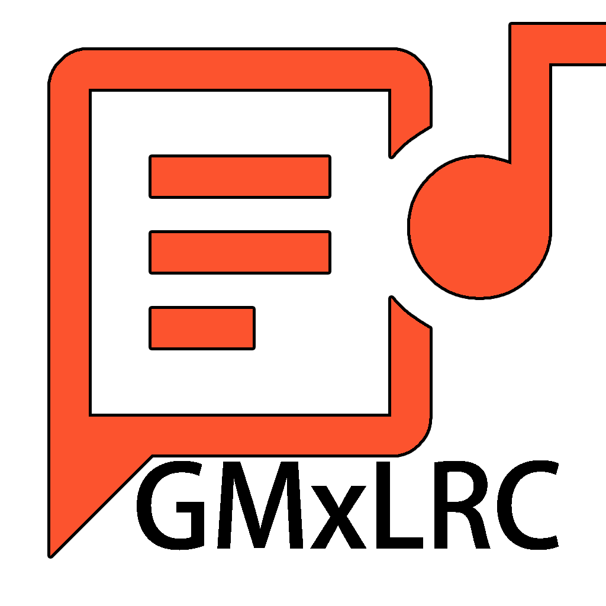

# GMxLRC
 
A simple GUI for MxLRC 
Based on commit [601c234](https://github.com/fashni/MxLRC/commit/601c23437b657d48c2eba93d563d61a22671ff47)

## Additional Feature
- Auto-read token from file
1. Create `token.txt` in the working dir
2. Paste your user token into `token.txt`

## Requirements
- Python 3.9+
- pyqt5
 
## LICENSE
[The MIT License](LICENSE)

## Special Thanks
- [MxLRC](https://github.com/fashni/MxLRC) by [fashni](https://github.com/fashni)